# BG2211 - Introduction to Computational Thinking

Name: Sylfr Serenity Tan Yi Qing

Matric. No.:

All of the code written in the source files, and as attached in this document were written on MATLAB release R2021b.

This report is accessible online in the event of errors with printing the pictures. The link can be found below.

https://github.com/NekoDrone/biecalc/blob/main/bg2211/assignment%201/writeup/submission.md

## Assignment 1

The questions chosen for this assignment are as follows: 1,2,3,4,6. There is no solution for 5.

All code used in answering this assignment can be found at the following github repository:

https://github.com/NekoDrone/biecalc/ under `./bg2211/assignment 1/src/`

### Question 1

**A:** _Solve the following differential equation in MATLAB using solver 'ode45': $\frac{dy}{dt}=2t+t^2+5$ . Solve this equation for the time interval $[0\space5]$ with a step size of $0.2$, and the initial condition is $0$. Plot $t$ vs $y$._

---

The source code for this solution can be found in `./question1/index.m`. Comments are included in the source file for further explanations and considerations.

`./question1/index.m`:
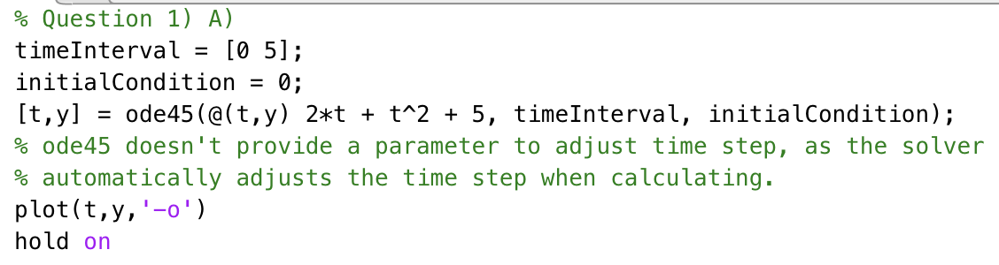

Plot of t against y for Q1a.

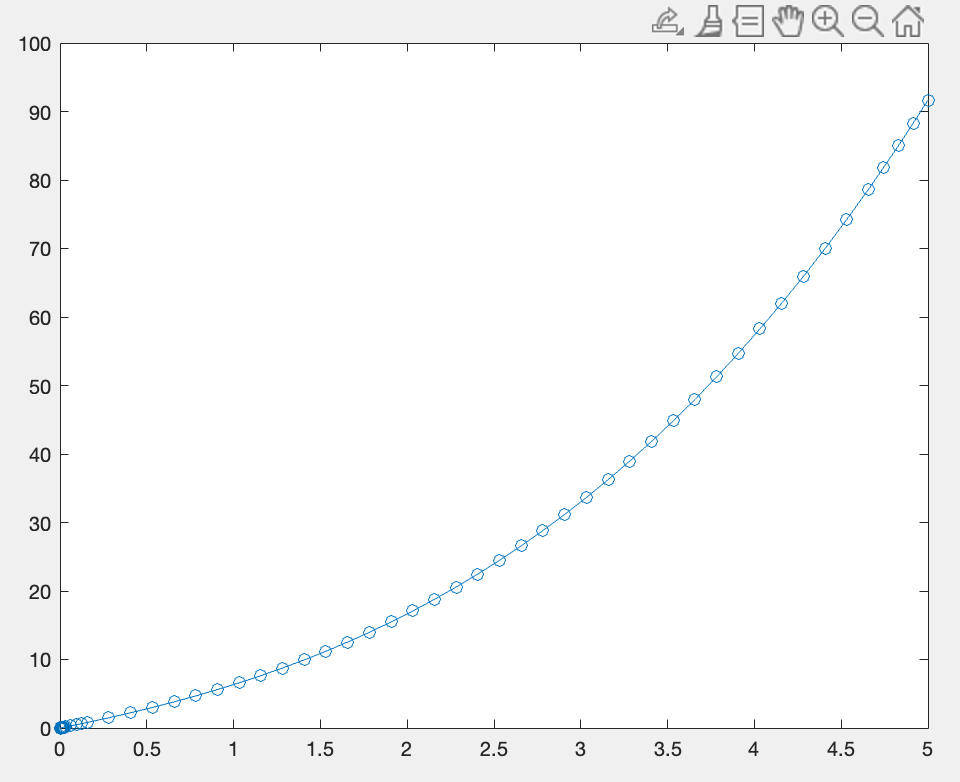

  

**B:** _Solve the above differential equation analytically and write the function file to evaluate $y$ for the time interval $[0\space5]$ with a step size of $0.2$ and the initial condition is $0$. Plot $t$ vs $y$._

---

The source code for this solution can be found in `./question1/index.m` and `./question1/equationToPlotFor1b.m`. Comments are included in the source file for further explanations and considerations.

`./question1/index.m`:

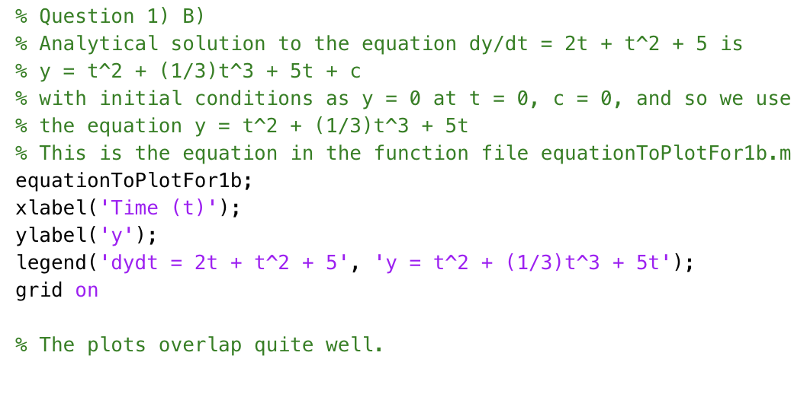

`./question1/equationToPlotFor1b.m`:

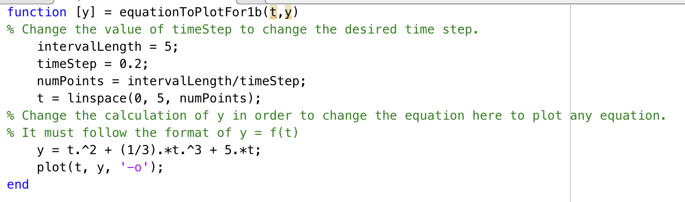

Plot of t against y for Q1a.

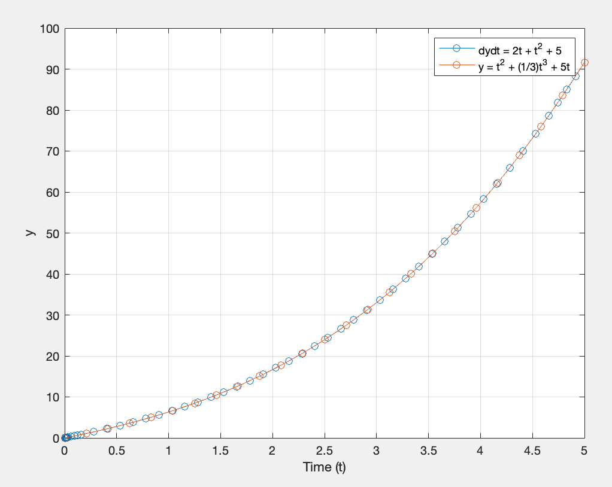

As shown above, the plots for both approaches overlap quite well.

  

### Question 2

_Solve this system of equation using Gauss Elimination with Partial Pivoting in MATLAB by writing a Function file. Write general code which can handle any number of unknowns._

$10y+z=2$

$x+4y-z=6$

$2x+4y+z=5$

---

The source code for this solution can be found in `./question2/index.m` and in particular, `./question2/gaussElim.m`. Comments are included in the source file for further explanations and considerations.

The solution uses a recursive function, rather than an iterative function, in order to perform the elimination to get the upper triangular matrix. The backwards substitution was done iteratively, as the substitution can be done using a matrix dot product instead of performing a recursive calculation.

The biggest consideration for this question was adapting it to be able to solve for any system of equations of any size (up to a reasonable limit). The solution was tested up to 6 unknowns with 6 equations.

`./question2/index.m`:

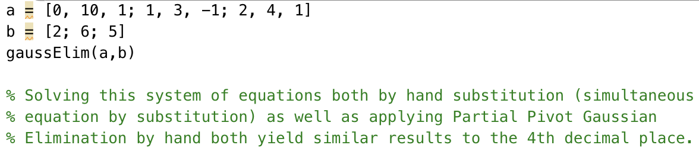

`./question2/gaussElim.m`:

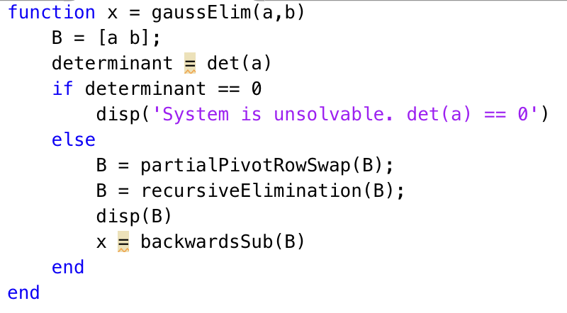

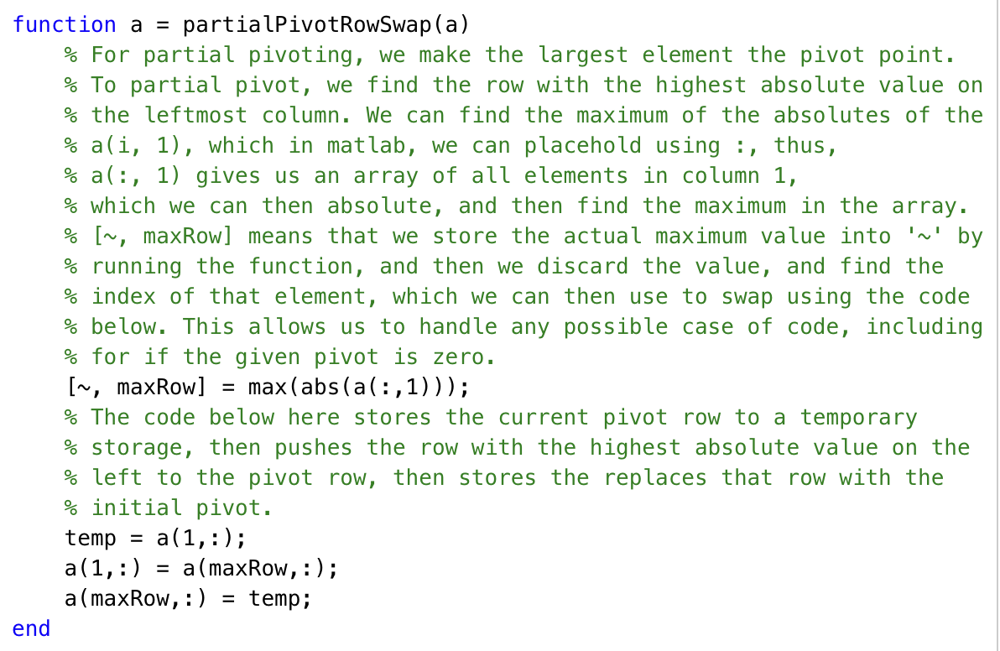

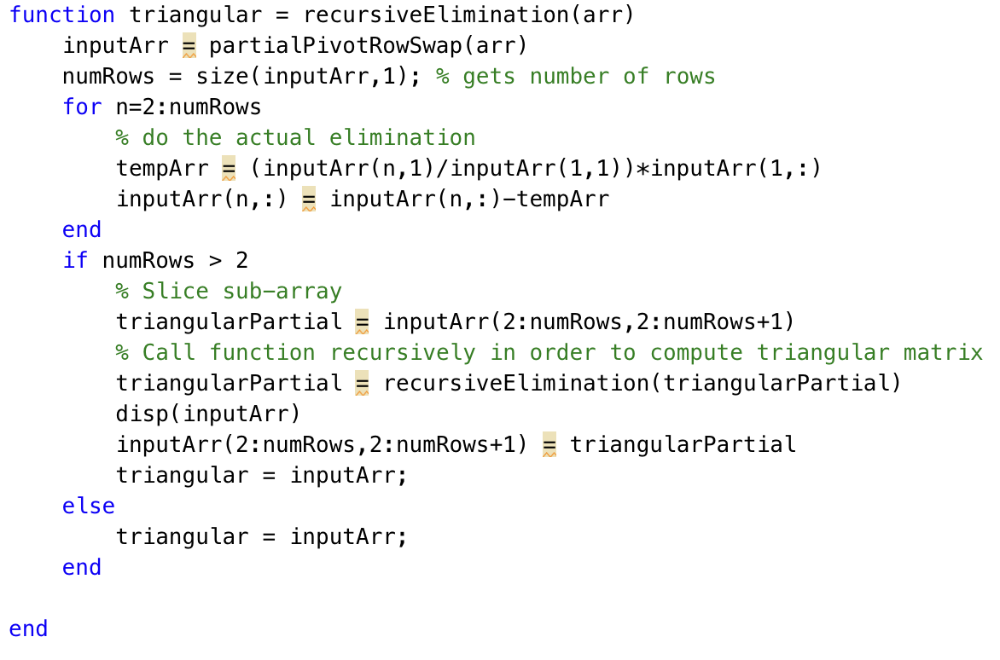

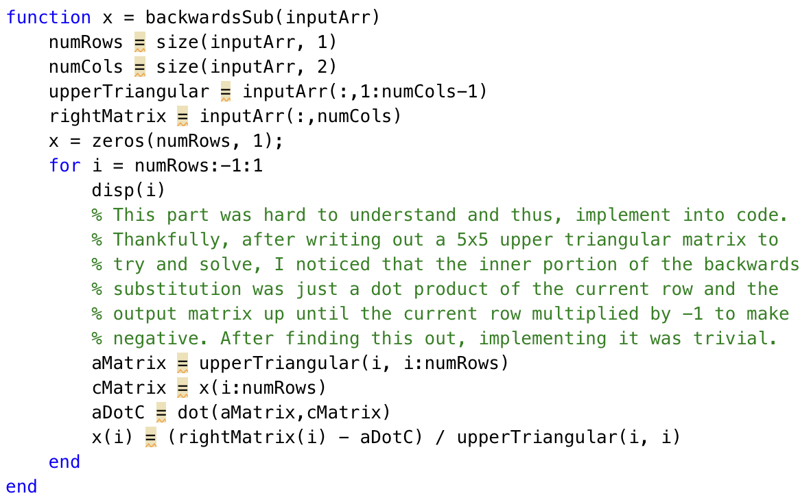

Output:

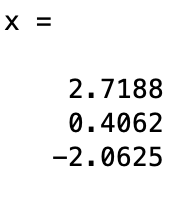

The intention behind using a recursive solution rather than an interative one was to increase extensibility. For a system of equation of n unknowns, utilising a recursive function allows for the solution to operate at $O(n)$ time complexity, whereas the iterative solution would operate at $O(n^2)$ time complexity, due to the nested for loops in the iterative solution.

  

### Question 3

_Consider the function $f(x)=x^3-2x+4$ on the interval $[-1.1]$ with $h=0.25$. Write the MATLAB function file to find the first derivatives in the entire interval by all three methods i.e., forward, backward, and centered finite difference approximations._

---

The source code for this solution can be found in `./question3/index.m` and in particular, `./question3/calcDerivative.m`. Comments are included in the source file for further explanations and considerations.

`./question3/index.m`: Generate points for input

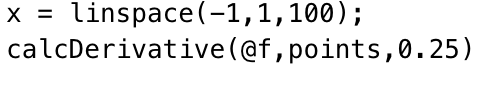

`./question3/f.m`: Input function

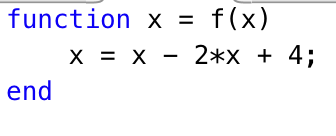

`./question3/calcDerivative.m`:

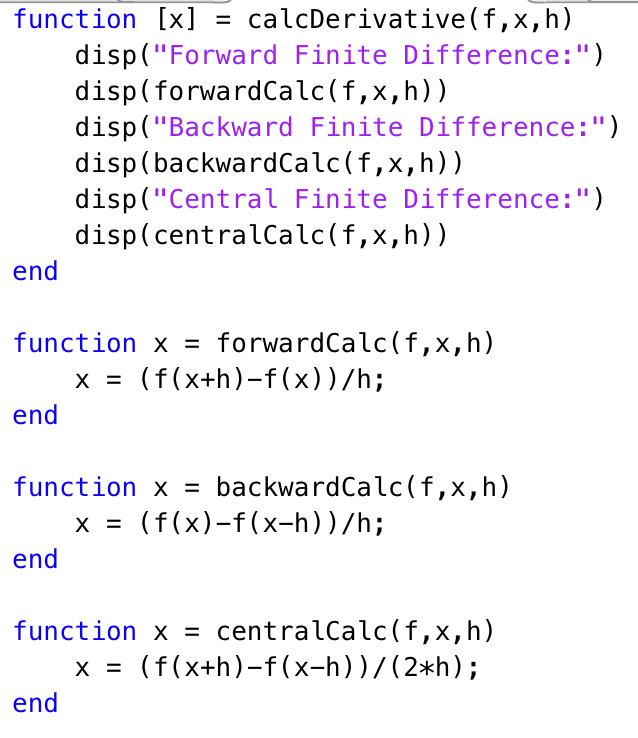

Output:

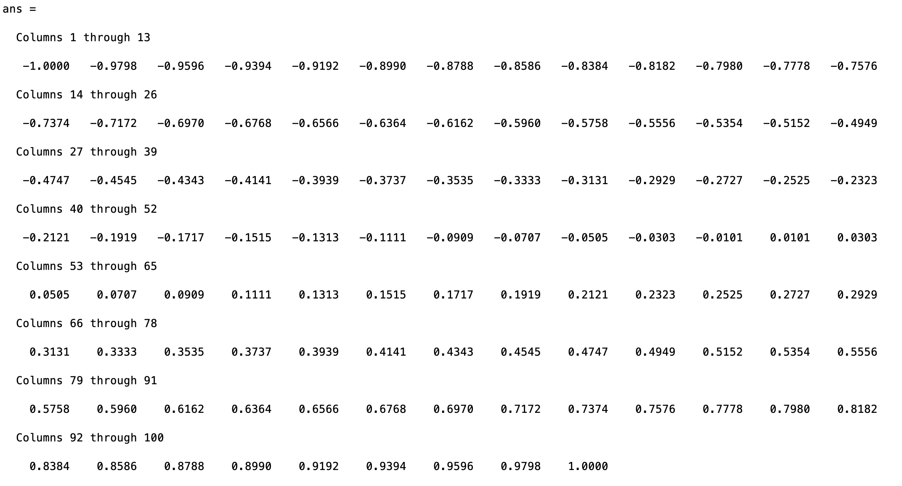

  

### Question 4

_You are designing a spherical tank to hold water for a small village in a developing country. The volume of liquid it can hold can be computed as follows:_

$$V = \pi h^2\frac{[3R-h]}{3}$$

_Where $V=$ Volume $[m^3]$, $h=$ depth of water in tank $[m]$, and $R=$ the tank radius $[m]$._

_If $R=3m$, what depth must the tank be filled to so that it holds $30m^3$?_

_Write a function file to solve for the depth of the tank using three iterations of either one of Newton-Raphson or Secant method in MATLAB. You may like to use the initial guess of 0 and 3._

_Compare the above obtained solution with the one obtained using the MATLAB built-in solver._

---

To solve this question, the **Newton-Raphson method** was chosen.

The source code for this solution can be found in `./question4/index.m` and in particular, `./question4/newtonRaphson.m`. Comments are included in the source file for further explanations and considerations.

Additionally, in `../../newtonRaphson.ts`, a generalised Newton-Raphson implementation written in TypeScript can be found.

`./question4/index.m`:

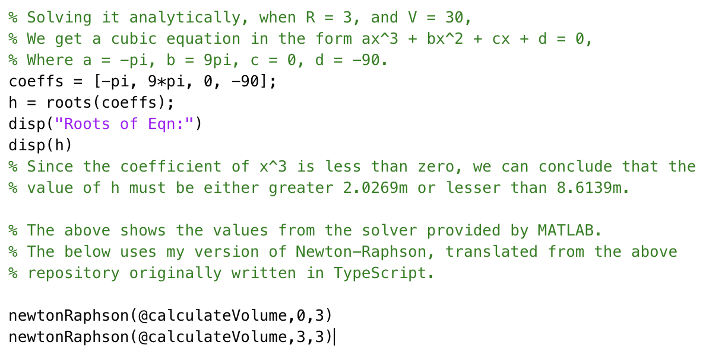

`./question4/newtonRaphson.m`:

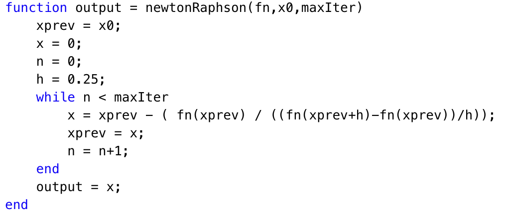

Output:

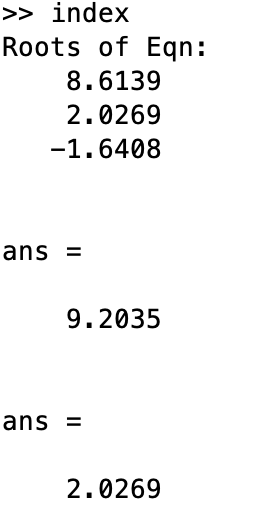

As seen above, this implementation of Newton Raphson was able to get close to both roots, with the guess starting at 0 being less accurate than the guess starting at 3. However, with one more additional iteration on this, it would most likely converge to the analytically solved value of the root.

  

### Question 6

_Write a MATLAB function that takes in the input of the coefficients of a quadratic equation in the form of a vector._

_The function then calculates the discriminant and checks if the discriminant if more than 0, equal to 0, or less than 0._

_If the discriminant is more than 0, it displays the message 'The equation has two real roots', calculates the roots, and returns the roots in the form of a vector._

_If the discriminant is equal to 0, it displays 'The equation has a double root', calculates and returns the value of the root._

_If the discriminant is less than zero, it displays 'The equation has no real roots'._

_Test your function on the following equations:_

_a) $3x^2=4x+1$_

_b) $x^2+10x+25$_

_c) $x^2+4x+5$_

---

The source code for this solution can be found in `./question6/index.m` and in particular, `./question6/quadraticSolver.m`. Comments are included in the source file for further explanations and considerations.

`./question6/index.m`:

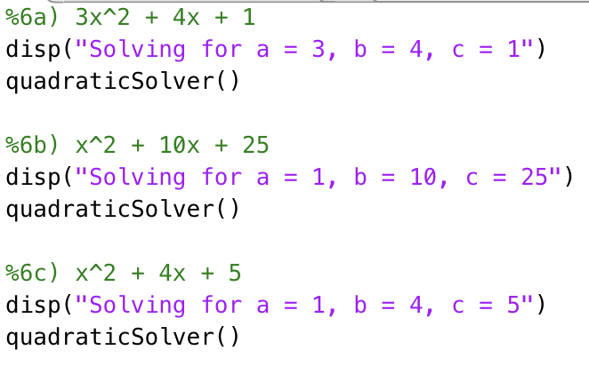

`./question6/quadraticSolver.m`:

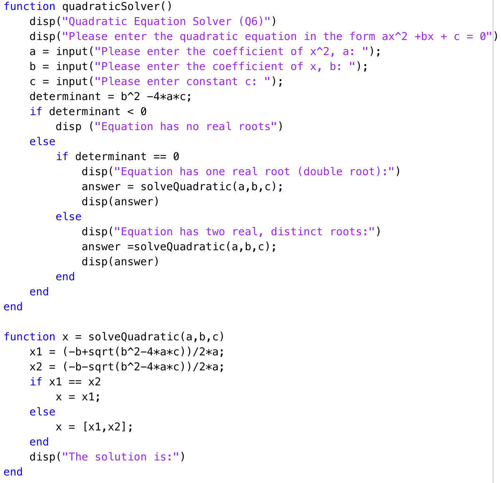

Outputs:

a) 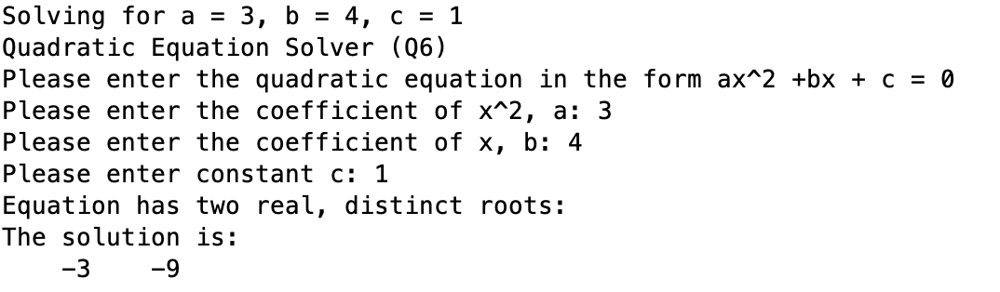

b) 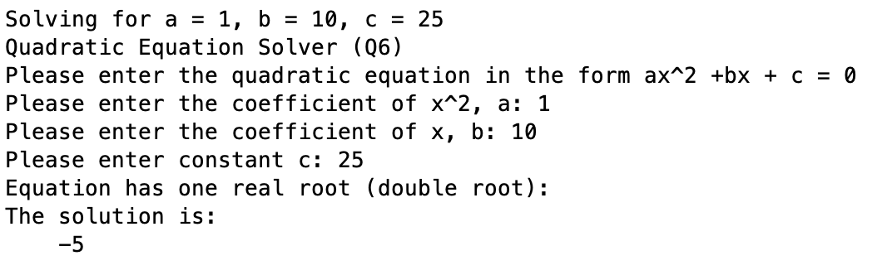

c) 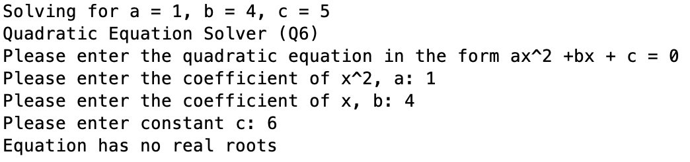
