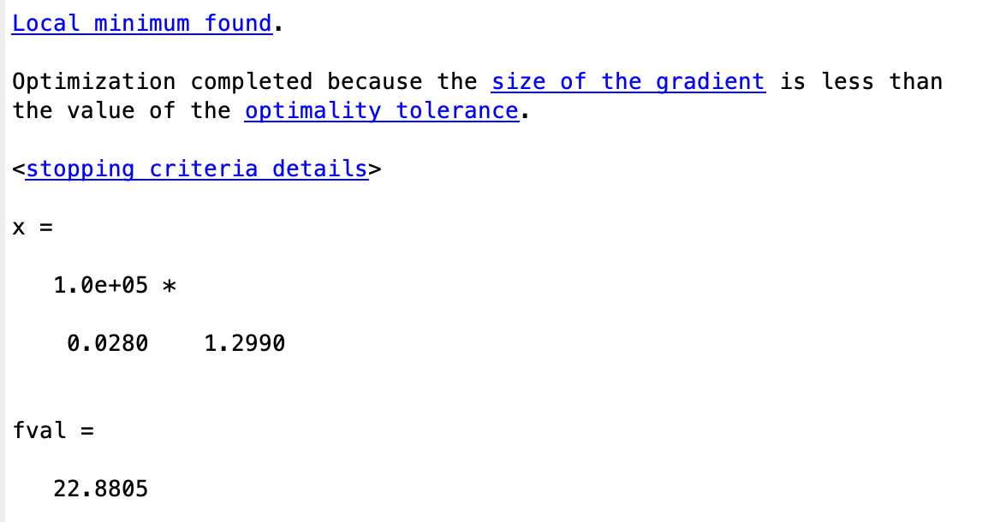
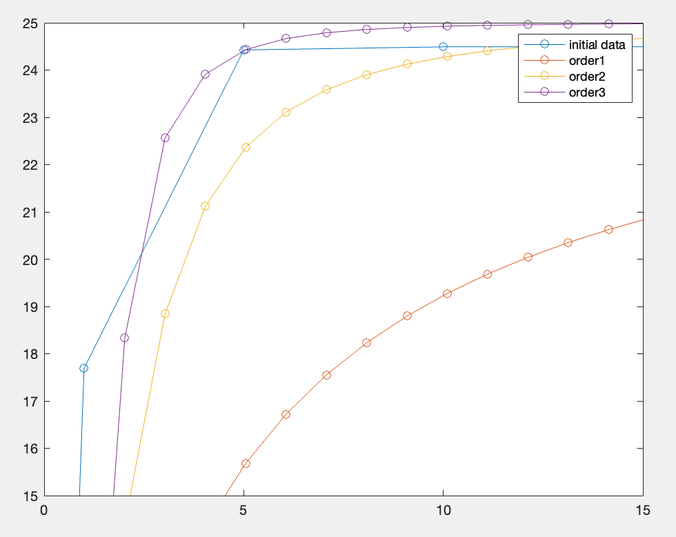
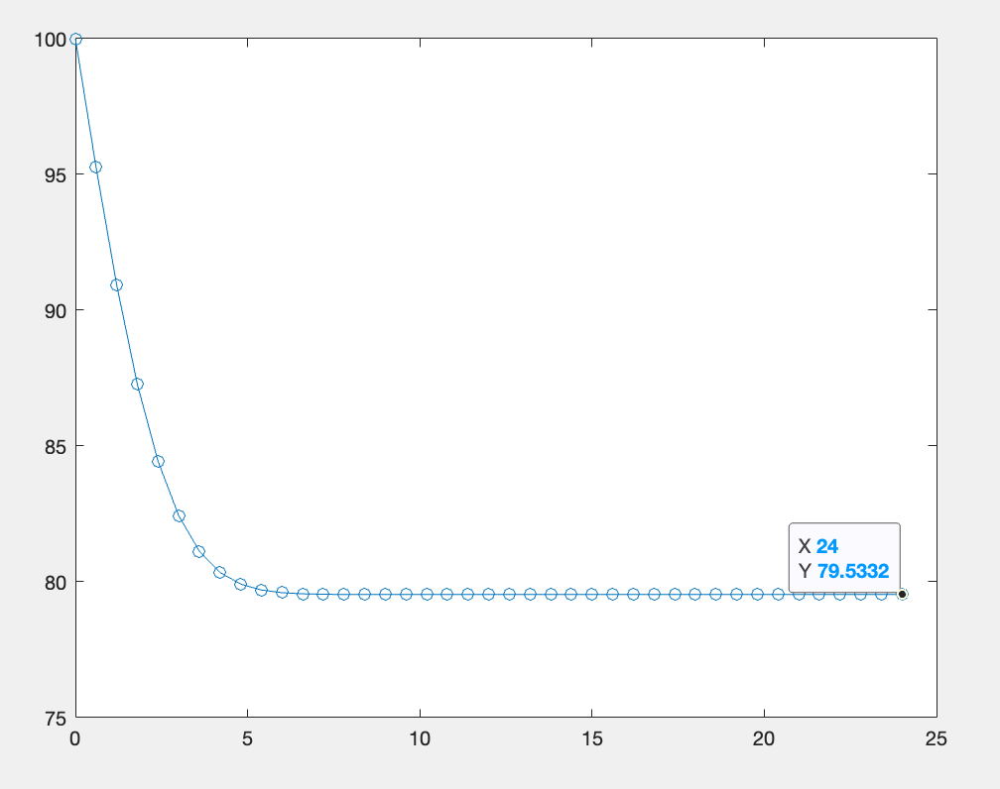
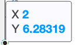
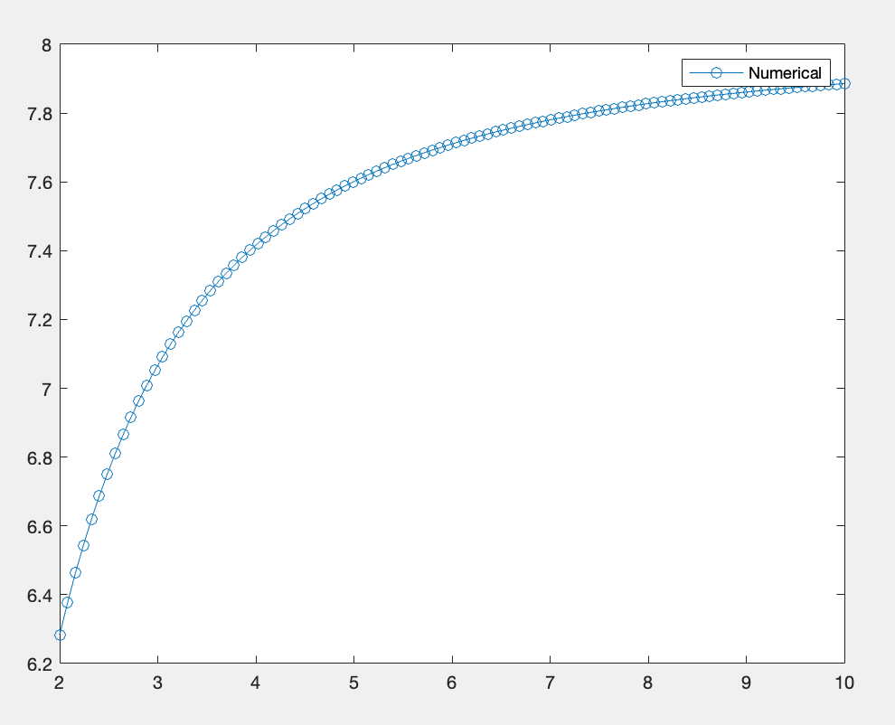
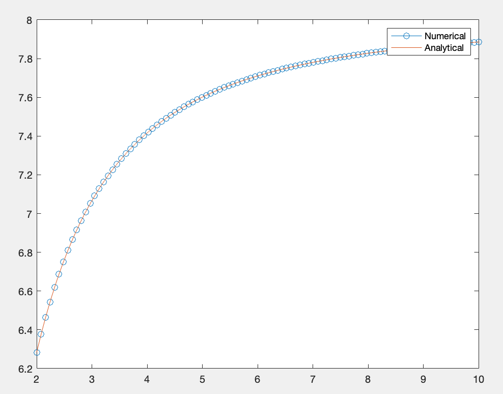

# BG2211 - Introduction to Computational Thinking

Name: Sylfr Serenity Tan Yi Qing
Matriculation Number: U2022474B

All of the code written in the source files, and as attached in this document were written on MATLAB release R2021b.

This report is accessible online in the event of errors with printing the pictures. The link can be found below.
[https://github.com/NekoDrone/biecalc/blob/main/bg2211/assignment%202/writeup/submission.md](https://github.com/NekoDrone/biecalc/blob/main/bg2211/assignment%202/writeup/submission.md)

## Assignment 2

All code used in answering this assignment can be found at the following GitHub repository:

[https://github.com/NekoDrone/biecalc/](https://github.com/NekoDrone/biecalc/) under `./bg2211/assignment 2/src/`

## Question 1

The cost of refined oil when shipped via the Malacca Straits to Japan in dollars per kiloliter was given as the linear sum of the crude oil cost, the insurance, customs, freight cost for the oil, loading and unloading cost, sea berth cost, submarine pipe cost, storage cost, tank area cost, refining cost, and freight cost of product as:

$$
\begin{aligned}
c = c_c+c_i+c_x+\frac{2.09\times10^4\space t^{-0.3017}}{360} + \frac{1.064\times10^6\space at^{0.4925}}{52.47q(360)} \\
+ \frac{4.242\times10^4\space at^{0.7952}+1.813ip(nt+1.2q)^{0.861}}{52.47q(360)} \\
+ \frac{4.25\times10^3\space a(nt+1.2q)}{52.47q(360)}+\frac{5.042\times10^3\space q^{0.1899}}{360} \\
+ \frac{0.1049q^{0.671}}{360}
\end{aligned}
$$

Given the constant values of $a,\space c_c,\space c_i,\space c_x\space i,\space n,\space p$, use a computer code to compute the minimum cost of oil and the optimum tanker size $t$ and refinery size $q$ by Newton's Method.

---

The question is asking for a multivariate approximation using Newton's Method.

The given equation is rather hefty, and involves many constants, especially after being given fixed values of all but three symbols. Using some simplification and collapsing of constants, we can rewrite the given function as

$$
\begin{align}
c=k_0+k_1t^{a_1}+k_2\frac{t^{a_2}}{q}+k_3\frac{t}{q}+1.2+k_4q^{a_3}\\+k_5q^{a_4}+k_6\frac{t^{a_5}}{q}+k_7(2t+1.2q)^{a_6}
\end{align}
$$

Where, after substituting the values of $a,\space c_c,\space c_i,\space c_x\space i,\space n,\space p$, we will get the values of the constants $k$ and $a$ as

- $k_0=13.9$
- $k_1=58.65,\space a_1=-0.3017$
- $k_2=112.657,\space a_2=0.4925$
- $k_3=0.44999$
- $k_4=13.006,\space a_3=-0.1899$
- $k_5=0.00029139,\space a_4=0.671$
- $k_6=0.44915,\space a_5=0.7952$
- $k_7=0.000019196,\space a_6=0.861$

As seen above, the values of $k_5$ and $k_7$ are small, on orders of magnitude of $\times10^{-3}$ and $\times10^{-4}$. For an approximation using the first order Taylor Series as applied to Newton's Method, for terms involving constants $k_5$ and $k_7$, we can ignore them for they are sufficiently small to be negligible to the overall optimisation.

We can then obtain an approximation of the above equation as

$$
c=k_0+k_1t^{a_1}+k_2\frac{t^{a_2}}{q}+k_3\frac{t}{q}+1.2+k_4q^{a_3}+k_6\frac{t^{a_5}}{q}
$$

From here, we can give this function to MATLAB, and have it optimise for $t$ and $q$ for minima.

The source code for this solution can be found in `./question1/index.m` and in particular, `./question1/costEquation.m`. Comments are included in the source file for further explanations and considerations.

`./question1/index.m`:

```matlab
%index.m

x0 = [1,1];
fun = @(x)costEquation(x(1),x(2));
[x,fval] = fminunc(fun, x0);
x
fval
```

`./question1/costEquation.m`:

```matlab
function [c] = costEquation(t,q)
	qAdj = 1/6.63*q;
	k0=13.9;
	k1=58.05;
	a1=-0.30217;
	k2=112.657;
	a2=0.4925;
	k3=0.44999;
	k4=14.006;
	a3=-0.1899;
	% k5 = 0.00029139;
	% a4 = 0.671;
	k6=0.44915;
	a5=0.7952;
	%k7 = 0.000019196;
	%a6 = 0.861;
	c = k0 + 1.2 + k1*t^a1 + k2*t^a2/qAdj + k3*t/qAdj + k4*qAdj^a3 + k6*t^a5/qAdj;
end
```

The reasoning behind `qAdj = 1/6.63*q` is because of unit conversion. $1\text{ kL}=6.63\text { bbl}$.

The output of this function follows:


## Question 2

Enzymatic reactions are used extensively to characterize biologically mediated reactions in environmental engineering. Proposed rate expressions for an enzymatic reaction are given below where \[S\] is the substrate concentration and v0 is the initial rate of reaction. Which formula best fits the experimental data? (Here $k$ and $K$ are fitting parameters.)
$$v_0=k[S],\space v_0=\frac{k[S]^2}{K+[S]^2},\space v_0=\frac{k[S]^2}{K+[S]^3}$$

\- data would be provided here \-

---

The approach to this question is rather simple. We can plot the data onto a graph, and plot the three given rate of reaction equations, and visually find the best fit.

After some adjustments to the values of $k$ and $K$, we can see the following output:


The graph is zoomed in to the range of $0\leq x\leq15$ and $15\leq y\leq 25$.

From the plot, we can see that the third order rate equation fits the data the closest. With some additional adjustments to $k$ and $K$, the third order rate equation of $v_0=\dfrac{k[S]^2}{K+[S]^3}$ fits the curve best.

The source code for this solution can be found in `./question2/dataPlot.m` .

`./question2/dataPlot.m`:

```matlab
function [] = dataPlot()
	sActual = [0.01 0.05 0.1 0.5 1 5 10 50 100]
	v0Actual = [0.000063636 0.007952 0.063472 6.0049 17.690 24.425 24.491 24.5 24.5]

	plot(sActual,v0Actual,'-o')
	hold on

	s1 = linspace(0,100);
	v01 = order1(s1)
	plot(s1,v01,'-o')

	s2 = s1;
	v02 = order2(s2)
	plot(s2,v02,'-o')

	s3 = s1;
	v03 = order3(s3)
	plot(s3,v03,'-o')

	legend("initial data", "order1", "order2", "order3")
	xlim([0,15])
	ylim([15,25])
	hold off
end

function [v0] = order1(s)
	k=25;
	K=3;
	v0 = (k.*s)./(K+s);
end

function [v0] = order2(s)
	k=25;
	K=3;
	v0 = (k*s.^2)./(K+s.^2);
end

function [v0] = order3(s)
	k=25;
	K=3;
	v0 = (k*s.^3)./(K+s.^3);
end
```

## Question 3

A drug is encapsulated in a polymer and then released slowly into the bloodstream of patients. $100 \mu\text{g}$ of a drug in a controlled release capsule injected into a patient. The drug is released at a rate of $8e^{-0.1t^2} \mu\text{g/h}$, where $t$ is hours after the injection. Use Matlab toolbox to calculate what fraction of the drug remains in the capsule after $24\text{h}$.

---

The question is a rather simple IVP, where
$$\frac{dy}{dt}=-8e^{-0.1t^2},\space t=0,y=100$$

Where $y$ is the amount of drug remaining in the capsule.

Solving this, we would use the Runge-Kutta method to solve ODEs. In MATLAB, this would be the function `ode45()`.

At time remaining $t=24$, there is a plateau at $y\approx 80$. Thus, approximately 80% of the drug remains in the capsule after 24 hours.



This is accurate, as the value of $\dfrac{dy}{dt}$ tends to zero as $t$ approaches infinity, and so for a sufficiently long amount of $t$, the rate of change of the drug is closer to zero.

The source code for this solution can be found in `./question3/index.m` .

`./question3/index.m`:

```matlab
[t,y] = ode45(@(t,y) -8*exp(1)^(-0.12*t^2),[0 24],100);
plot(t,y,'-o')
```

## Question 4

A superellipse is defined by the inequality
$$|\frac{x}{a}|^n+|\frac{y}{b}|^n\leq 1$$

where $x$ and $y$ are cartesian coordinates, and $a$ and $b$ are the length of the long and short axes, with $n>2$ as the deformation parameter. An example of a superellipse centered at $r_0$ with $a=2$ and $b=1$ is shown in the figure below, where $e_x$ and $e_y$ are the unit vectors pointing to the direction of long and short axes, respectively, and where $e_x\perp e_y$. All vectors are column vectors.

\- an image follows\-

Use MATLAB Toolbox to numerically calculate the area of $S$ for given $a$ and $b$. For $a=2,\space b=1$, plot $S$ as a function of $n\in [2,10]$, and compare your result with the analytical formula
$$S=\frac{4^{1-\frac{1}{n}}ab\sqrt{\pi}\space\Gamma(1+\frac{1}{n})}{\Gamma(\frac{1}{2}+\frac{1}{n})}$$

---

The given inequality for a superellipse is for a superellipse centered at $(0,0)$. We can isolate the outer perimeter of an ellipse by removing the inequality, and equating it to $1$, such that
$$|\frac{x}{a}|^n+|\frac{y}{b}|^n=1$$

Removing the absolute operators on both terms yields the equation
$$(\frac{x}{a})^n+(\frac{y}{b})^n=1$$

Which gives exactly one quarter of the perimeter curve traced out by the superellipse. Specifically, this equation describes the curve along the positive $x$ and positive $y$ axes.

By doing some rearrangement, we can obtain
$$y=\frac{\sqrt[n]{1-(\frac{x}{a})^n}}{b}$$

Integrating this for the limits of $[0,a]$ yields one fourth of the area of the superellipse,
$$S=4\int_0^ay\space dx=4\int_0^a\space\frac{\sqrt[n]{1-(\frac{x}{a})^n}}{b}\space dx$$

Given the values of $a=2,\space b=1$, we obtain
$$S=4\int_0^2\space\sqrt[n]{1-(\frac{x}{2})^n}\space dx$$

We can numerically integrate the expression on the right hand side in MATLAB and multiply the result by 4 for the range of $[0,2]$.

We can then plot a graph of $S$ against different values of $n$, and compare it with the analytical formula, which simplifies into

$$
S=2\sqrt{\pi}\frac{4^{1-\frac{1}{n}}\space\Gamma(1+\frac{1}{n})}{\Gamma(\frac{1}{2}+\frac{1}{n})}
$$

These are the results

Solving numerically for $n=2$:


Therefore, $S=6.28319$ at $n=2$.

Output of Numerical Calculation:


Output of Analytical Formula:


As seen from the above, the numerical solution is very well fit to the analytical solution.

The source code for this solution can be found in `./question4/index.m` .

`./question4/index.m`

```matlab
n = linspace(2,10,100);

numericalS = zeros(100,1); % clear the array
analyticalS = zeros(100,1);

for i=1:1:length(n)
	ithElementOfN = n(i);
	numericalS(i) = 4*integral(@(x) funcToIntegrate(x,ithElementOfN), 0,2);
	analyticalS(i) = analyticalFormula(ithElementOfN);
end

plot(n,numericalS,'-o');
hold on
plot(n,analyticalS);
legend("Numerical", "Analytical");

function [y] = funcToIntegrate(x,n)
	xOver2=x/2;
	xOver2toN=xOver2.^n;
	y=nthroot(1-xOver2toN,n);
end

function [S] = analyticalFormula(n)
	twoRootPi = 2*sqrt(3.141592653);
	numerator1 = 4.^(1-(1/n));
	numerator2 = gamma(1+(1/n));
	numerator = numerator1*numerator2;
	denominator = gamma((1/2)+(1/n));
	S = twoRootPi*numerator/denominator
end
```

Different plotting was achieved simply by commenting out unused code.
